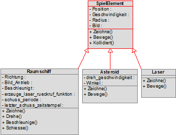

# EvFBW_Python_2022
Python Programmierkurs 2022 für Jugendliche beim Evangelischen Familienbildungswerk

## Software
Wir arbeiten auf Windows Computern.

Installiere das Python Übersetzer Programm von
[www.python.org](https://www.python.org/downloads/)

Installiere den Textbearbeitungs Programm Notepad++ von
[notepad-plus-plus.org](https://notepad-plus-plus.org/downloads/)

Installiere das Bildbearbeitungs Programm The Gimp von
[www.gimp.org](https://www.gimp.org/)

## Zusatz Module
Unsere Python Skripte benötigen zusätzliche Software.
Wir installieren die Module über das Programm Pip.

Um alle in dem Kurs benötigten Module zu installieren
musst Du das folgende Kommando ausführen
```
    pip install -r requirements.txt
```

Um alle in dem Kurs benötigten Module wieder zu deinstallieren
musst Du das folgende Kommando ausführen
```
    pip uninstall -r requirements.txt
```

Ihr könnt jederzeit den Inhalt dieser Datei 
mit allen in dem Kurs aktuell benötigten Modulen ersetzen.
Dazu musst Du das folgende Kommando ausführen
```
    pip freeze > requirements.txt
```

## 10. & 17. November & 8. Dezember 2022
Wir beginnen mit den Grundlagen
- Hallo Welt Programm
- Römische Zahl aus Arabischer Zahl

### hallo_welt_bunt.py
1. Führe folgende Kommandos aus
```
    pip install PyQt5
    python hallo_welt_bunt.py
```
2. Das Programm öffnet ein Fenster,
in dem der Text "Hallo Welt, mein Name ist ..." angezeigt wird.
1. Schließe das Programm.
1. Öffne das Python Skript im Programm notepad++.
1. Finde den Text und ergänze Deinen Namen.
1. Kommando ausführen
```
    python hallo_welt_bunt.py
```
7. Das Programm zeigt jetzt Deinen Namen.

### roemische_zahl.py
Das Programm erwartet ein eine Arabische Zahl als Argument.
1. Wenn keine Arabische Zahl angegeben wird, wird ein Hilfetext angezeigt.
Führe folgendes Kommando aus
```
    python roemische_zahl.py
```
2. Wenn eine Arabische Zahl angegeben wird, wird dafür eine Römische Zahl angezeigt.
Führe folgendes Kommando mit dem Argument 7 aus
```
    python roemische_zahl.py 7
```
3. Das Programm zeigt die Römische Zahl VII an.
```
    VII
```

### roemische_zahl_test.py
Das Programm testet das eigentliche Programm zur Berechnung der Römischen Zahl.
Dieses Testprogramm ist Euer Sicherheitsnetz und gibt Euch Roten Alarm
wenn das eigentliche Programm fehlerhaft arbeitet.

1. Führe folgendes Kommando aus
```
    python roemische_zahl_test.py
```
2. Wenn alle Tests erfolgreich ausgeführt wurden, erhält man folgende Ausgabe
```
..
----------------------------------------------------------------------
Ran 2 tests in 0.001s

OK
```
3. Wenn ein oder mehrere Tests fehlgeschlagen sind, erhält man folgende Ausgabe
```
.F
======================================================================
FAIL: teste_roemische_zahl_1_bis_10 (__main__.roemische_zahl_test)
----------------------------------------------------------------------
Traceback (most recent call last):
  File "D:\Sources\EvFBW_Python_2022\roemische_zahl_test.py", line 30, in teste_roemische_zahl_1_bis_10
    self.assertEqual(ergebnis, 'VIII')       # Melde einen Fehler wenn die Variable ergebnis nicht den Zeichenketten-Text VII enthält
AssertionError: 'VII' != 'VIII'
- VII
+ VIII
?    +


----------------------------------------------------------------------
Ran 2 tests in 0.007s

FAILED (failures=1)
```

## 15. Dezember 2022
Wir programmieren diesmal nicht, sondern lernen 
einerseits die Versionskontrolle git
und andererseits den Debugger in PyCharm kennen.

### git
Wir klicken im Windows Explorer mit der rechten Maustaste 
auf das Verzeichnis EvFBW_Python_2022
und wählen das Kontextmenü "TortoiseGit, Log".
Es öffnet sich das Fenster Log Messages - TortoiseGit
und wir lassen es für den Rest des Kurses geöffnet.

Wir sehen in diesem Fenster die folgenden Einträge.
Wenn wir wieder mit der rechten Maustaste auf diese Log Einträge klicken,
können wir mit dem Kontextmenü "Switch/Checkout to this..."
diese Version des Programmes herunterladen.
Wir können in der Dateiliste im unteren Bereich dieses Fensters
die Dateien mit der linken Maustaste doppelklicken.
Dadurch öffnet sich ein Vergleichsfenster (Diff)
mit dem sehen können wie sich die ausgewählte Datei verändert hat.

#### 1. Ausgangspunkt: Spiel mit schwarzem Fenster
```
SHA-1: a6bc3375ecf7a51b79bf9790ee8d79568f2fd86b

* Kursvorbereitung, Spiel, Reset
```

#### 2. Spiel mit Raumschiff
```
SHA-1: 2ada1f93baddd01cca98f07f7be16078d50219a8

* Kursvorbereitung, Spiel, Raumschiff
```

#### 3. Spiel mit Raumschiff und Weltraum
```
SHA-1: 156ee926dcf48a567327e6427485f7a9270689ad

* Kursvorbereitung, Spiel, Weltraum
```

#### 4. Spiel mit Raumschiff, Weltraum und Asteroiden
```
SHA-1: f3472a42df05d912aed4501fa388a4f1db94a7ee

* Kursvorbereitung, Spiel, Asteroid
```

#### 5. Spiel mit Raumschiff, Weltraum, Asteroiden und Laser
```
SHA-1: cf14ea267c8ad0544a5bd8f5c3b823952e64b5d5

* Kursvorbereitung, Spiel, Laser
```

#### 6. Laser können Asteroiden zerstören
```
SHA-1: 299d6ceaaa9bb37abcc3d7fa29e3dd149b6ae315

* Kursvorbereitung, Spiel, Treffer: Laser auf Asteroid
```

#### 7. Asteroiden können das Raumschiff zerstören
```
SHA-1: 3670c8879a6144f0683f14f4d0b8426a96b884b4

* Kursvorbereitung, Spiel, Kollision: Raumschiff mit Asteroid, Game Over Text
```


### PyCharm Debugger
Jedes mal nachdem wir eine bestimmte Version 
des dimorphos Programmes mit "Switch/Checkout to this..." heruntergeladen haben,
öffnen wir im Anschluss das Verzeichnis dimorphos in PyCharm.

Die Entwicklungsumgebung PyCharm erkennt automatisch die darin enthaltene Datei requirements.txt
und schlägt vor eine Virtuelle Umgebung (Virtual Environment) einzurichten,
und wir bestätigen dies.

Wir warten ein wenig bis PyCharm alles eingerichtet hat.
Unter Umständen schlägt PyCharm automatisch vor pygame zu installieren,
weil dieses Modul in der Datei requirements.txt genannt wird.
Falls nicht müssen wir die Datei requirements.txt öffnen
und dann die Installation von pygame von dort veranlassen.

Sobald PyCharm alles installiert hat, 
werden für die Datei __main__.py zwei Knöpfe in der Werkzeugleiste aktiviert,
ein grünes Dreieck und ein grüner Käfer.
Mit dem Dreieck können wir das Programm einfach ausführen.
Mit dem grünen Käfer können wir das Programm im Debugger von PyCharm starten.

Wenn wir vorher sogenannte Haltepunkte (Breakpoints) im Quelltext gesetzt haben,
führt der Debugger das Programm bis zum Haltepunkt aus 
und unterbricht dann die Ausführung sodass wir uns die Variablen genauer anschauen können.

Wir setzen gezielt viele Haltepunkte im Quelltext 
um die Ausführung des Programmes genauer kennenzulernen.
Dies ist eine gute Technik um fremden Quelltext besser zu verstehen.
Lassen wir uns also heute Zeit das Spielprojekt 
und die darin enthaltene Objekt Orientierte Programmierung besser kennenzulernen.

Falls ihr ein Verständnis für das Programm entwickelt habt,
könnt ihr gerne anfangen gezielt eine Funktion des Spiels zu verändern.

### Klassen
Neben der Klasse Dimorphos dass das eigentliche Spiel darstellt,
haben wir weitere Kassen, die die Spielelemente darstellen,
wie zum Beispiel das Raumschiff, die Asteroiden und die Laserstrahlen.
Wir werden feststellen, dass alle diese Klassen gemeinsame Eigenschaften haben werden.


Wir können die Gemeinsamkeiten alle dieser Klassen 
in einer sogenannten Basisklasse zusammenfassen
und dann die Technik der Vererbung nutzen.
Diese Basisklasse nennen wir SpielElement
und die Klassen Raumschiff, Asteroid und Laser 
erben alle von der Klasse SpielElement.
Dadurch verringert sich die Menge an Quelltext.
Außerdem dürfen wir Funktionen der Basisklasse in den erbenden Klassen auch verändern.


